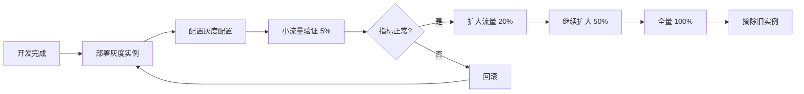

# 灰度发布使用指南

## 功能概述

Agent-Gateway 现已支持完整的灰度发布能力，基于 Nacos 实现：
- ✅ 配置灰度（独立 DataID，不同实例加载不同配置）
- ✅ 流量灰度（按 Header 或权重路由到灰度实例）
- ✅ 服务实例灰度标记（metadata 标识）
- ✅ 多层降级保障（灰度失败自动回退）

---

## 灰度模式

### 模式 1: 配置灰度（推荐）

**原理**: 灰度实例监听独立的配置 DataID

```
正常实例:
  - 监听 ratelimit.json（稳定配置）
  - QPS: 100

灰度实例:
  - 监听 ratelimit-beta.json（新配置）
  - QPS: 200（测试新限流策略）
```

**优势**:
- ✅ 配置完全隔离
- ✅ 不影响正常实例
- ✅ 可以随时回滚配置

---

### 模式 2: 流量灰度

**原理**: 灰度实例注册时标记 metadata，网关按权重分配流量

```
请求到达网关
    ↓
检查 X-Canary Header
    ↓
┌─────────────┬──────────────┐
│ X-Canary:   │   无 Header  │
│ true/beta   │              │
↓             ↓              ↓
路由到灰度实例    按权重随机分配
                  ↓
              10% → 灰度实例
              90% → 正常实例
```

**优势**:
- ✅ 精确控制流量比例
- ✅ 支持手动指定灰度
- ✅ 渐进式放量

---

## 快速开始

### 步骤 1: 部署灰度实例

**环境变量配置**:

```bash
# 灰度实例启动脚本
export CANARY_ENABLED=true
export CANARY_MODE=config        # 或 traffic
export CANARY_ID=beta
export CANARY_DATA_ID_SUFFIX=-beta
export CANARY_WEIGHT=10          # 仅 traffic 模式，10% 流量

./agent-gateway
```

**Docker 部署**:

```yaml
# docker-compose.canary.yml
version: '3'
services:
  agent-gateway-canary:
    image: agent-gateway:latest
    environment:
      - CANARY_ENABLED=true
      - CANARY_MODE=config
      - CANARY_ID=beta
      - CANARY_DATA_ID_SUFFIX=-beta
    ports:
      - "11557:11556"  # 不同端口
```

---

### 步骤 2: 创建灰度配置（配置灰度模式）

**在 Nacos 控制台创建**:

1. 登录 Nacos 控制台
2. 配置管理 → 配置列表
3. 找到原配置 `ratelimit.json`
4. 点击"克隆"，修改 DataID 为 `ratelimit-beta.json`
5. 修改配置内容（如调整限流值）
6. 发布

**配置示例**:

```json
// ratelimit.json (正常配置)
{
  "default_qps": 100,
  "enabled": true
}

// ratelimit-beta.json (灰度配置)
{
  "default_qps": 200,
  "enabled": true
}
```

---

### 步骤 3: 注册灰度实例（流量灰度模式）

**下游服务注册时添加 metadata**:

```bash
# 注册灰度实例
curl -X POST "http://localhost:8848/nacos/v1/ns/instance" \
  -d "serviceName=my-skill-service" \
  -d "ip=10.0.1.200" \
  -d "port=8080" \
  -d "metadata.canary=true" \
  -d "metadata.canary_id=beta" \
  -d "metadata.canary_weight=10"
```

---

### 步骤 4: 验证灰度

**方式 1: 显式指定灰度**

```bash
curl http://localhost:11556/gateway/invoke/skill/my-skill \
  -H "X-Canary: true" \
  -d '{"input": {"key": "value"}}'
```

**方式 2: 按权重自动分配**

```bash
# 多次请求，约 10% 会路由到灰度实例
for i in {1..100}; do
  curl http://localhost:11556/gateway/invoke/skill/my-skill \
    -d '{"input": {"key": "value"}}'
done
```

**方式 3: 查看日志**

```bash
# 灰度实例日志
tail -f logs/agent-gateway.log | grep "canary"

# 输出示例:
# {"level":"info","msg":"canary mode enabled","mode":"config","canary_id":"beta"}
# {"level":"debug","msg":"canary routing: explicit header match"}
```

---

## 灰度发布流程

### 标准流程



### 详细步骤

#### 1. 准备阶段

- [ ] 代码开发完成，测试通过
- [ ] 准备灰度环境配置
- [ ] 确定灰度指标（错误率、延迟、QPS）

#### 2. 部署灰度实例

```bash
# 启动 1 个灰度实例
docker-compose -f docker-compose.canary.yml up -d
```

#### 3. 创建灰度配置

- 在 Nacos 创建 `-beta` 后缀的配置
- 修改需要测试的配置项
- 发布配置

#### 4. 小流量验证（5%）

```bash
export CANARY_WEIGHT=5
# 重启灰度实例生效
docker-compose -f docker-compose.canary.yml restart
```

**观察指标**:
- 错误率 < 1%
- P99 延迟 < 200ms
- 业务指标正常

#### 5. 逐步放量

```bash
# 20% 流量
export CANARY_WEIGHT=20
docker-compose -f docker-compose.canary.yml restart

# 观察 30 分钟...

# 50% 流量
export CANARY_WEIGHT=50
docker-compose -f docker-compose.canary.yml restart

# 观察 1 小时...
```

#### 6. 全量发布

```bash
# 100% 流量
export CANARY_WEIGHT=100
docker-compose -f docker-compose.canary.yml restart

# 观察 2 小时，确认无问题
```

#### 7. 替换旧实例

```bash
# 更新正常实例镜像
docker-compose pull
docker-compose up -d

# 摘除灰度实例
docker-compose -f docker-compose.canary.yml down
```

---

## 回滚策略

### 场景 1: 配置灰度回滚

**问题**: 灰度配置导致错误率上升

**回滚步骤**:

1. **立即回滚配置**
   ```bash
   # 在 Nacos 控制台
   # 1. 找到 ratelimit-beta.json
   # 2. 点击"历史版本"
   # 3. 选择上一个稳定版本
   # 4. 点击"回滚"
   ```

2. **观察恢复**
   ```bash
   # 查看灰度实例日志
   tail -f logs/agent-gateway.log | grep error
   ```

3. **停止灰度实例**（可选）
   ```bash
   docker-compose -f docker-compose.canary.yml down
   ```

---

### 场景 2: 流量灰度回滚

**问题**: 灰度实例代码有 bug

**回滚步骤**:

1. **立即切流**
   ```bash
   # 设置权重为 0
   export CANARY_WEIGHT=0
   docker-compose -f docker-compose.canary.yml restart
   ```

2. **修复代码**
   ```bash
   # 修复 bug
   git commit -m "fix: xxx"
   git push
   ```

3. **重新部署**
   ```bash
   docker-compose -f docker-compose.canary.yml build
   docker-compose -f docker-compose.canary.yml up -d
   ```

---

## 监控和告警

### 关键指标

| 指标 | 正常阈值 | 灰度阈值 | 告警动作 |
|------|---------|---------|---------|
| 错误率 | < 0.1% | < 1% | 立即回滚 |
| P99 延迟 | < 100ms | < 200ms | 观察告警 |
| QPS | 稳定 | 稳定 | 观察 |
| 实例健康度 | 100% | > 80% | 摘除实例 |

### Prometheus 查询

```promql
# 灰度实例错误率
sum(rate(gateway_requests_total{canary="true",status=~"5.."}[5m])) 
/ 
sum(rate(gateway_requests_total{canary="true"}[5m]))

# 正常实例错误率
sum(rate(gateway_requests_total{canary="false",status=~"5.."}[5m])) 
/ 
sum(rate(gateway_requests_total{canary="false"}[5m]))

# 灰度实例 P99 延迟
histogram_quantile(0.99, 
  rate(gateway_request_duration_seconds_bucket{canary="true"}[5m]))
```

### Grafana 仪表盘

创建对比视图：
- 左图：正常实例指标
- 右图：灰度实例指标
- 叠加显示，方便对比

---

## 高级用法

### 多环境灰度

```bash
# 开发环境灰度
export CANARY_ID=dev-beta
export CANARY_DATA_ID_SUFFIX=-dev-beta

# 测试环境灰度
export CANARY_ID=test-beta
export CANARY_DATA_ID_SUFFIX=-test-beta

# 生产环境灰度
export CANARY_ID=prod-beta
export CANARY_DATA_ID_SUFFIX=-prod-beta
```

### 按用户灰度

修改 `canary.go` 中间件，支持按用户 ID 灰度：

```go
// 按用户 ID 灰度（尾号 10% 的用户走灰度）
userID := c.GetHeader("X-User-ID")
if userID != "" {
    lastDigit := userID[len(userID)-1]
    if lastDigit == '0' { // 10% 用户
        c.Set("is_canary", true)
    }
}
```

### A/B 测试

同时部署多个灰度版本：

```bash
# 版本 A (5% 流量)
CANARY_ID=version-a CANARY_WEIGHT=5

# 版本 B (5% 流量)
CANARY_ID=version-b CANARY_WEIGHT=5

# 正常版本 (90% 流量)
无灰度标记
```

---

## 故障排查

### 问题 1: 灰度配置未生效

**现象**: 灰度实例仍然使用正常配置

**排查**:
```bash
# 1. 检查环境变量
echo $CANARY_ENABLED
echo $CANARY_MODE

# 2. 检查 Nacos 配置
curl "http://localhost:8848/nacos/v1/cs/configs?dataId=ratelimit-beta.json&group=agent-gateway"

# 3. 查看启动日志
tail -f logs/agent-gateway.log | grep "canary mode enabled"
```

**解决**:
- 确认环境变量已设置
- 确认 Nacos 中存在灰度配置
- 重启灰度实例

---

### 问题 2: 流量未路由到灰度实例

**现象**: 设置 `X-Canary: true` 但仍然路由到正常实例

**排查**:
```bash
# 1. 检查灰度实例是否注册
curl "http://localhost:8848/nacos/v1/ns/instance/list?serviceName=my-skill-service"

# 2. 检查 metadata 是否包含 canary=true
# 返回结果中查找 metadata.canary

# 3. 查看网关日志
tail -f logs/agent-gateway.log | grep "canary routing"
```

**解决**:
- 确认灰度实例已注册到 Nacos
- 确认 metadata 包含 `canary=true`
- 检查 ServiceResolver 缓存是否更新

---

### 问题 3: 灰度实例健康检查失败

**现象**: Nacos 标记灰度实例为不健康

**排查**:
```bash
# 1. 检查实例进程
ps aux | grep agent-gateway

# 2. 检查端口监听
netstat -tlnp | grep 11556

# 3. 检查健康检查路径
curl http://localhost:11556/health
```

**解决**:
- 重启灰度实例
- 检查健康检查配置
- 查看实例日志排查启动问题

---

## 最佳实践

### ✅ 推荐做法

1. **始终从小流量开始**
   - 5% → 20% → 50% → 100%
   - 每个阶段观察至少 30 分钟

2. **设置明确的回滚标准**
   - 错误率 > 1% 立即回滚
   - P99 延迟 > 200ms 告警
   - 业务指标下降 > 5% 回滚

3. **保留正常实例作为降级**
   - 灰度期间不要摘除正常实例
   - 确保随时可以切回

4. **记录灰度日志**
   - 标记所有灰度请求
   - 方便后续分析对比

5. **自动化灰度流程**
   - 使用 CI/CD 自动部署
   - 集成自动化测试验证

### ❌ 避免做法

1. **不要直接全量发布**
   - 跳过灰度阶段风险极高
   - 一旦出问题影响所有用户

2. **不要忽略告警**
   - 灰度期间的告警必须立即处理
   - 宁可回滚也不要冒险

3. **不要长时间保持灰度**
   - 灰度验证周期建议 < 24 小时
   - 避免配置分叉难以维护

---

## 总结

通过 Nacos + Agent-Gateway 的灰度发布能力，你可以：
- ✅ 安全地发布新版本
- ✅ 精确控制流量比例
- ✅ 快速回滚问题版本
- ✅ 数据驱动决策（指标对比）

**生产就绪**，可以放心使用！🚀
